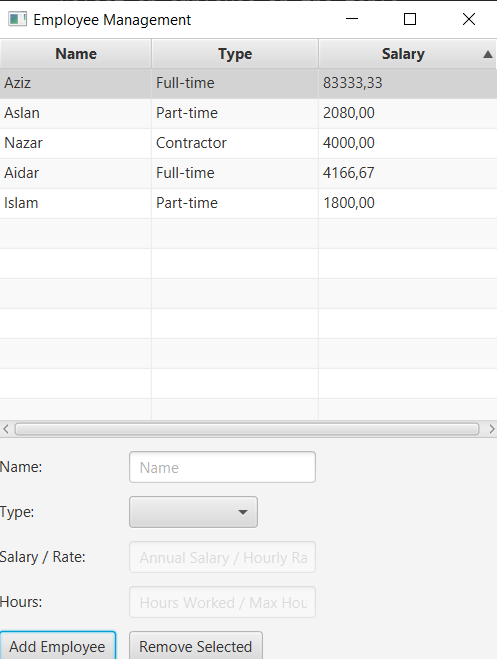
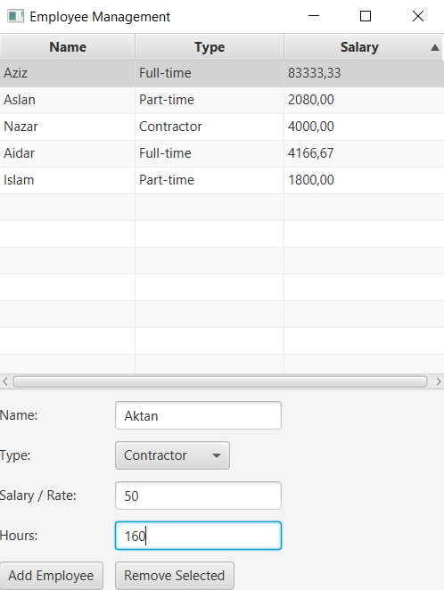

# Employee Management System

## Description
This project is a JavaFX application for managing a list of employees and their calculated salaries. 
It demonstrates the use of object-oriented programming principles like inheritance and polymorphism 
by defining an abstract `Employee` class and its subclasses: `FullTimeEmployee`, `PartTimeEmployee`, 
and `Contractor`. Each employee type has a specific salary calculation method.

The GUI allows users to:
- Add new employees.
- Display a list of employees with their names, types, and calculated salaries.
- Remove employees from the list.
- Validate inputs for each employee type.

## Technologies Used
- JavaFX for the GUI.
- Java for the backend logic.
- IntelliJ IDEA for development.

---

## Instructions to Run the Program

### Prerequisites:
- Install Java 8 or higher.
- Install a JavaFX SDK compatible with your Java version.
- Set up your JavaFX environment in the IDE.

### Clone the Repository:
```bash
git clone <your-repo-link>
cd <your-repo-folder>
```

### Setup JavaFX in Your IDE:
- Add JavaFX library paths to your project's VM options.
```bash
--module-path /path-to-javafx-sdk/lib --add-modules javafx.controls,javafx.fxml
```

### Run the Application:
- Open the project in IntelliJ IDEA or your preferred IDE.
- Run the `EmployeeManagementApp` class.

---

## How to Use

1. **Add Employees**:
   - Enter the employee's name in the "Name" field.
   - Select the type of employee (Full-time, Part-time, Contractor) from the dropdown.
   - Fill in additional fields based on the selected type:
     - **Full-time**: Enter the annual salary.
     - **Part-time**: Enter the hourly rate and hours worked.
     - **Contractor**: Enter the hourly rate and maximum hours.
   - Click "Add Employee" to add the employee to the list.

2. **View Employees**:
   - The table displays all added employees, including their names, types, and calculated salaries.

3. **Remove Employees**:
   - Select an employee in the table.
   - Click "Remove Selected" to delete the employee.

---

## Screenshots




